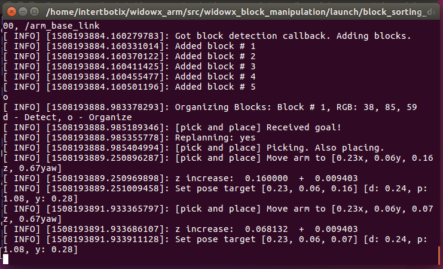

.. _chapter_setupWithROS:

Setup With ROS
==============

The documentation assumes that ``ROS Kinetic`` is already installed on the host pc (Ubuntu 16.04). If not, follow the instructions below.

Install ROS Kinetic
~~~~~~~~~~~~~~~~~~~

`<http://wiki.ros.org/kinetic/Installation/Ubuntu>`_

Open a terminal and type in the following
::

    sudo sh -c 'echo "deb http://packages.ros.org/ros/ubuntu $(lsb_release -sc) main" > /etc/apt/sources.list.d/ros-latest.list'
    sudo apt-key adv --keyserver hkp://ha.pool.sks-keyservers.net:80 --recv-key 421C365BD9FF1F717815A3895523BAEEB01FA116
    sudo apt update
    sudo apt upgrade
    sudo apt install ros-kinetic-desktop
    sudo rosdep init
    rosdep update
    echo "source /opt/ros/kinetic/setup.bash" >> ~/.bashrc
    source ~/.bashrc

RealSense ROS Package Install
~~~~~~~~~~~~~~~~~~~~~~~~~~~~~

There are a few prerequisites.
::

    wget -O enable_kernel_sources.sh http://bit.ly/en_krnl_src
    bash ./enable_kernel_sources.sh

**Sensor package**

::

    sudo apt install ros-kinetic-librealsense ros-kinetic-realsense-camera
    sudo reboot

**Kernel 4.10 installation work-around**
::

    sudo apt-get install libglfw3-dev
    cd ~
    git clone https://github.com/IntelRealSense/librealsense.git
    cd librealsense
    mkdir build && cd build
    cmake ../
    make && sudo make install
    cd ..
    sudo cp config/99-realsense-libusb.rules /etc/udev/rules.d/
    sudo udevadm control --reload-rules && udevadm trigger
    ./scripts/patch-realsense-ubuntu-xenial.sh

Additional dependencies
~~~~~~~~~~~~~~~~~~~~~~~

::

    sudo apt install git htop
    sudo apt install ros-kinetic-moveit ros-kinetic-pcl-ros

Setting dialout permission for Arbotix
~~~~~~~~~~~~~~~~~~~~~~~~~~~~~~~~~~~~~~

Replace yourUserAccount with the system account you are using
::

    sudo usermod -a -G dialout yourUserAccount
    sudo reboot

Clone widowx_arm repository and build
~~~~~~~~~~~~~~~~~~~~~~~~~~~~~~~~~~~~~

::

    mkdir -p ~/widowx_arm/src
    cd ~/widowx_arm/src
    git clone https://github.com/Interbotix/widowx_arm.git .
    git clone https://github.com/Interbotix/arbotix_ros.git -b parallel_gripper
    cd ~/widowx_arm
    catkin_make

ROS control of the arm independent of the SR300 Sensor
~~~~~~~~~~~~~~~~~~~~~~~~~~~~~~~~~~~~~~~~~~~~~~~~~~~~~~
Open up a terminal window and enter the following commands.
::

    cd ~/widowx_arm
    source devel/setup.bash
    roslaunch widowx_arm_bringup arm_moveit.launch sim:=false sr300:=false

This should load RVIZ with the proper WidowX arm bringup. You can move the arm using the visual representation on screen, choosing one of the many "Planning Library" under the Context tab and then hitting "Plan and Execute" under the Planning Tab. There are also several presets you can choose from. Once you're done, you can close the program by returning to your terminal window and pressing CTRL + C.

.. image:: _static/rvizInitial.png

ROS control of the arm with the SR300 Sensor
~~~~~~~~~~~~~~~~~~~~~~~~~~~~~~~~~~~~~~~~~~~~
Open up a terminal window and enter the following commands
::

    cd ~/widowx_arm
    source devel/setup.bash
    roslaunch widowx_arm_bringup arm_moveit.launch sim:=false sr300:=true

This should load RVIZ with the proper WidowX arm bringup, as well as load in the drivers for the SR300. You should see a 3D point map representation of your workspace on the right. You can still move the arm using the visual representation on screen, and hitting "Plan and Execute" under the Planning Tab. We need to move the arm so that we can adjust the camera angle and position.

Arranging your SR300
~~~~~~~~~~~~~~~~~~~~
Keep the previous terminal open and change a few things in RVIZ. Under the Planning tab, in the Query options you will find the "Select Goal State" option.
Select the pulled_back_pose from the goal state. Press Update, then press Plan and Execute. Your arm should move back to a pulled back state, allowing the camera to see the base of the WidowX.
Change your view to a side view of the arm and camera representation. Move the SR300's angle so that the representation of the workspace is level to the base of the WidowX on-screen.
Change your view to an overhead view of the workspace. Move the Camera Stand so that the outline of the base of the WidowX matches to the cutout of the WidowX base on the SR300.

Open a second Terminal window. This will be a control window, so keep it visible when possible
::

    cd ~/widowx_arm
    source devel/setup.bash
    roslaunch widowx_block_manipulation block_sorting_demo.launch

This demo will allow us to do some new things that utilize the SR300's object detection abilities! Place blocks of different colors in the workspace (default are red and green), and in the terminal, type ``d`` for **detection of the blocks** and hit ``Enter``. Where the blocks were, there should be gray cubes shown on screen. At this point, you can either automatically sort all blocks detected by typing ``o`` (organize) in the terminal and hitting ``Enter`` or you can use the 3D representation of the object in RVIZ to pick and place the block wherever you like on the x and y axis. 

**Options**

**Detection of Blocks**

**Organize/Sort the red and green blocks**

